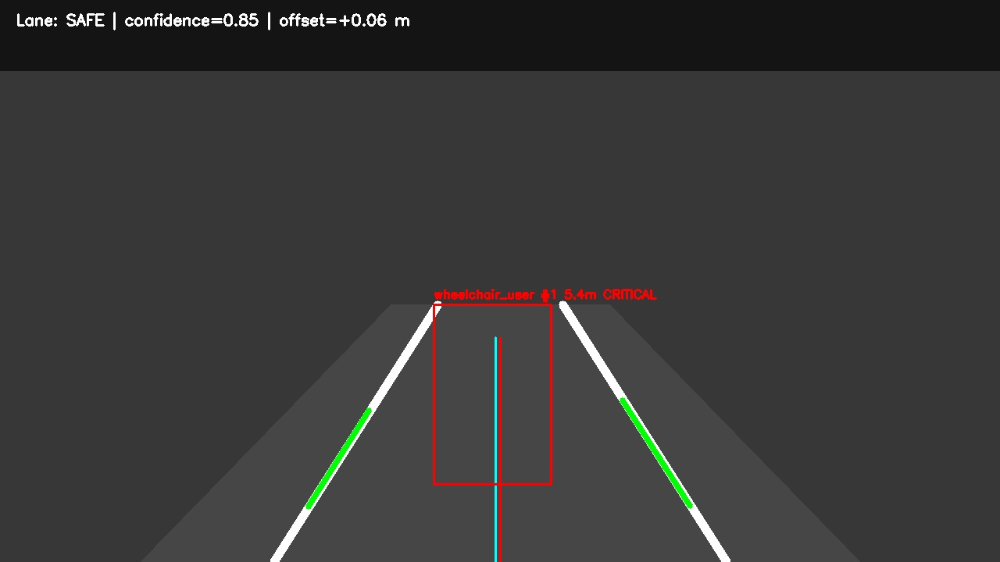
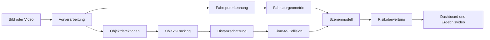

<div align="center">

# OpenADAS Vision Stack

### Modulare Computer-Vision- und Sicherheits-Pipeline für Fahrerassistenz und autonomes Fahren

[](https://github.com/hosseinAT/OpenADAS-Vision-Stack/actions/workflows/tests.yml)


[](LICENSE)

**Fahrspurerkennung · Objekt-Tracking · Distanzschätzung · Time-to-Collision · Risikobewertung**

</div>

---

## Überblick

**OpenADAS Vision Stack** ist ein eigenständig aufgebauter ADAS-Demonstrator für die kamerabasierte Analyse von Verkehrsszenen. Das Projekt verbindet klassische Bildverarbeitung, Fahrspurgeometrie, Objektverfolgung und eine vereinfachte Sicherheitsbewertung in einer modularen Python-Pipeline.

Der aktuelle Entwicklungsstand verarbeitet synthetische Bilder sowie aufgezeichnete Videos. Er erkennt Fahrspurmarkierungen, bestimmt die Position des Fahrzeugs relativ zur Fahrspurmitte, verfolgt vorgegebene Objektdetektionen über mehrere Frames, schätzt deren Entfernung und bewertet das Kollisionsrisiko.

Ein besonderer Anwendungsfall ist die Sicherheitsbewertung vulnerabler Verkehrsteilnehmer, beispielsweise von Fußgängern und Rollstuhlfahrern.

> **Projektstatus:** funktionsfähiger PC-basierter Prototyp. Eine physische Validierung auf NVIDIA Jetson, TensorRT-Inferenz, ROS2-Integration und Tests mit einer echten Fahrzeugkamera sind in der Roadmap enthalten, aber noch nicht abgeschlossen.

---

## Demo

<p align="center">
  
</p>

Die mitgelieferte Demo simuliert einen Rollstuhlfahrer innerhalb der Fahrspur. Die Pipeline berechnet Fahrspurstatus, Objektentfernung, Time-to-Collision und Risikostufe und speichert das visualisierte Ergebnis als `demo_output.jpg`.

Beispielausgabe:

```text
lane_status=SAFE
object=wheelchair_user, distance_m=5.40, ttc_s=4.00, risk=CRITICAL
Gespeichert: demo_output.jpg
```

---

## Kernfunktionen

| Modul | Funktion | Aktueller Stand |
|---|---|---|
| **Fahrspurerkennung** | Erkennung linker und rechter Fahrspurmarkierungen mit Canny und Hough-Transformation | Implementiert |
| **Fahrspurgeometrie** | Fahrspurmitte, seitliche Abweichung und Spurstatus | Implementiert |
| **Objekt-Tracking** | Zuordnung gleichartiger Objekte über Bounding-Box-Zentren | Implementiert |
| **Distanzschätzung** | Monokulare geometrische Näherung über Objektbreite und Kamerabrennweite | Implementiert |
| **Time-to-Collision** | TTC aus Entfernung und relativer Distanzänderung | Implementiert als Prototyp |
| **Risikobewertung** | `SAFE`, `CAUTION`, `WARNING`, `CRITICAL` | Implementiert |
| **Visualisierung** | Fahrspuren, Objekt-ID, Entfernung, TTC und Risikostufe | Implementiert |
| **Videoverarbeitung** | Verarbeitung und Speicherung aufgezeichneter MP4-Videos | Implementiert |
| **Automatisierte Tests** | Tests für Fahrspur-, Distanz-, Tracking- und Risikomodule | 6 Tests |
| **Deep Learning / YOLO** | Reale Objektdetektion aus Kamerabildern | Geplant |
| **ONNX / TensorRT** | GPU-optimierte Inferenz | Geplant |
| **NVIDIA Jetson** | Deployment und Benchmark | Noch nicht validiert |
| **ROS2 / CARLA** | Middleware- und Simulationsintegration | Geplant |

---

## Systemarchitektur



### Verarbeitungskette

1. Das Eingabebild wird in Graustufen umgewandelt, geglättet und mit Canny gefiltert.
2. Eine trapezförmige Region of Interest begrenzt die Analyse auf den Straßenbereich.
3. Hough-Linien werden nach Steigung und Bildposition in linke und rechte Fahrspuren getrennt.
4. Aus beiden Fahrspuren werden Fahrspurmitte und seitliche Abweichung berechnet.
5. Objektdetektionen werden über einen einfachen Centroid-Tracker mehreren Frames zugeordnet.
6. Die Distanz wird geometrisch aus Bounding-Box-Breite, angenommener Objektbreite und Brennweite geschätzt.
7. Aus Distanzänderung und TTC wird eine Risikostufe abgeleitet.
8. Alle Ergebnisse werden in einem gemeinsamen Dashboard visualisiert.

---

## Repository-Struktur

```text
OpenADAS-Vision-Stack/
├── .github/workflows/       # Continuous Integration
├── config/
│   └── default.yaml         # Kamera-, Fahrspur- und Risikoparameter
├── docs/
│   ├── assets/              # Demoabbildungen
│   └── GITHUB_UPLOAD_DE.md  # Upload-Anleitung
├── examples/
│   ├── demo_image.py        # Synthetische Demonstration
│   └── run_video.py         # Verarbeitung eigener Videos
├── openadas/
│   ├── config.py            # Konfigurationsverwaltung
│   ├── distance.py          # Distanz- und TTC-Berechnung
│   ├── lanes.py             # Fahrspurerkennung und Geometrie
│   ├── pipeline.py          # Zentrale Verarbeitungspipeline
│   ├── risk.py              # Risikoklassifikation
│   ├── tracking.py          # Centroid-Tracking
│   ├── types.py             # Datenmodelle
│   └── visualization.py     # Dashboard-Overlay
├── tests/                   # Automatisierte Tests
├── Dockerfile
├── LICENSE
├── pyproject.toml
└── README.md
```

---

## Installation

### Voraussetzungen

- Windows 10/11 oder Linux
- Python 3.10 oder neuer
- Git
- Eine virtuelle Python-Umgebung wird empfohlen

### Windows PowerShell

```powershell
py -m venv .venv
Set-ExecutionPolicy -Scope Process Bypass
.\.venv\Scripts\Activate.ps1
python -m pip install --upgrade pip
pip install -e ".[dev]"
```

### Linux

```bash
python3 -m venv .venv
source .venv/bin/activate
python -m pip install --upgrade pip
pip install -e ".[dev]"
```

---

## Schnellstart

### 1. Tests ausführen

```powershell
pytest
```

Erwartetes Ergebnis:

```text
6 passed
```

### 2. Synthetische Demo starten

```powershell
python -m examples.demo_image
```

Ergebnis:

```text
demo_output.jpg
```

### 3. Eigenes Video verarbeiten

```powershell
python -m examples.run_video --input input.mp4 --output output.mp4
```

Die aktuelle Videopipeline führt die Fahrspurerkennung aus. Eine automatische Deep-Learning-Objektdetektion für reale Videos ist noch nicht integriert.

---

## Konfiguration

Zentrale Parameter befinden sich in [`config/default.yaml`](config/default.yaml).

```yaml
camera:
  focal_length_px: 900.0

lane:
  roi_top_ratio: 0.60
  canny_low: 70
  canny_high: 160
  lane_width_m: 3.5

risk:
  caution_ttc_s: 6.0
  warning_ttc_s: 4.0
  critical_ttc_s: 2.5
  critical_distance_m: 7.0
```

Für eine reale Kamera müssen Brennweite, Bildauflösung, Perspektive und angenommene Objektbreiten korrekt kalibriert werden.

---

## Technische Grundlagen

### Fahrspurerkennung

Die Baseline nutzt klassische Computer-Vision-Verfahren:

- Gauß-Filterung
- Canny-Kantenerkennung
- Region of Interest
- probabilistische Hough-Transformation
- Steigungs- und Positionsfilter
- geometrische Bestimmung der Fahrspurmitte

### Distanzschätzung

Die geschätzte Distanz wird mit dem Lochkameramodell berechnet:

```text
Distanz = reale Objektbreite × Brennweite in Pixeln / Bounding-Box-Breite
```

Diese Methode ist eine Näherung. Ihre Genauigkeit hängt stark von Kamerakalibrierung, Objektorientierung und korrekter realer Objektbreite ab.

### Time-to-Collision

```text
TTC = Entfernung / Annäherungsgeschwindigkeit
```

Im aktuellen Prototyp wird die relative Bewegung aus aufeinanderfolgenden Distanzschätzungen abgeleitet. Für reale Videoanwendungen muss die tatsächliche Zeitdifferenz zwischen Frames beziehungsweise die Bildrate berücksichtigt werden.

### Risikostufen

| Stufe | Bedeutung |
|---|---|
| `SAFE` | Kein unmittelbares Kollisionsrisiko erkannt |
| `CAUTION` | Objekt nähert sich; erhöhte Aufmerksamkeit erforderlich |
| `WARNING` | Kurze TTC; Bremsbereitschaft erforderlich |
| `CRITICAL` | Sehr geringe Distanz oder kritische TTC |

---

## Qualitätssicherung

Das Repository enthält automatisierte Tests für:

- unterschiedliche OpenCV-Ausgabeformen von `HoughLinesP`
- Distanzschätzung
- TTC-Berechnung
- Risikoklassifikation
- Tracking-ID über mehrere Frames

Die Tests werden bei jedem Push und Pull Request über GitHub Actions ausgeführt.

```powershell
pytest -v
```

---

## Docker

Image erstellen:

```bash
docker build -t openadas-vision-stack .
```

Demo ausführen:

```bash
docker run --rm openadas-vision-stack
```

Hinweis: Die Demo erzeugt innerhalb des Containers eine Bilddatei. Für den Zugriff auf die Ausgabe sollte ein lokaler Ordner als Volume eingebunden werden.

---

## Validierungsstatus und Grenzen

Dieses Projekt ist ein **Portfolio- und Forschungsprototyp**, kein zertifiziertes Fahrerassistenzsystem.

Aktuelle Grenzen:

- keine automatische Deep-Learning-Objektdetektion in der Baseline
- keine kamerakalibrierte metrische Tiefenmessung
- keine Berücksichtigung der tatsächlichen Frame-Zeit in der aktuellen Tracking-Baseline
- begrenzte Robustheit bei Schatten, Baustellen, Regen und fehlenden Markierungen
- keine Sensorfusion mit Radar oder LiDAR
- keine Fahrzeugansteuerung
- keine physische Validierung auf NVIDIA Jetson
- keine sicherheitskritische Freigabe oder ISO-26262-Qualifizierung

> **Nicht für den Einsatz in realen Fahrzeugsteuerungen bestimmt.**

---

## Roadmap

### Phase 1 — Aktuelle Baseline

- [x] Fahrspurerkennung mit OpenCV
- [x] Fahrspurmitte und seitliche Abweichung
- [x] Centroid-Tracking
- [x] geometrische Distanzschätzung
- [x] TTC- und Risikobewertung
- [x] Dashboard-Visualisierung
- [x] automatisierte Tests und CI

### Phase 2 — Deep-Learning-Perception

- [ ] YOLO-/ONNX-Objektdetektor
- [ ] Rollstuhl- und Rollstuhlfahrererkennung
- [ ] Deep-Learning-Spurerkennung
- [ ] Fahrbahnsegmentierung
- [ ] robuste Multi-Object-Tracking-Methode

### Phase 3 — Embedded Deployment

- [ ] ONNX-Export
- [ ] TensorRT-FP16-Inferenz
- [ ] Latenz- und FPS-Benchmark
- [ ] NVIDIA-Jetson-Deployment
- [ ] GStreamer-Kamerapipeline

### Phase 4 — Autonomous-Driving Integration

- [ ] ROS2-Nodes und Topics
- [ ] CARLA-Simulation
- [ ] Kamera-Radar-Sensorfusion
- [ ] Bird's-Eye-View
- [ ] Shadow-Mode-Auswertung

---

## Bedeutung für autonomes Fahren

Das Projekt demonstriert zentrale Entwicklungsaufgaben aus dem Bereich ADAS und autonome Systeme:

- modulare Wahrnehmungsarchitektur
- Verarbeitung visueller Sensordaten
- Szenenverständnis
- geometrische Modellierung
- Objektverfolgung
- Sicherheits- und Risikologik
- reproduzierbare Tests
- Vorbereitung für Embedded-AI-Deployment

### Kurzbeschreibung für ein Vorstellungsgespräch

> I developed a modular ADAS vision pipeline in Python and OpenCV. The current system detects lane boundaries, estimates the lateral vehicle offset, tracks supplied object detections, estimates object distance, calculates time-to-collision, and assigns safety risk levels. I structured the software so that deep-learning models, ROS2, and TensorRT deployment can be integrated in later development stages.

---

## Autor

**Hossein Asadi**

- GitHub: [github.com/hosseinAT](https://github.com/hosseinAT)

---

## Lizenz

Dieses Projekt steht unter der [MIT-Lizenz](LICENSE).
