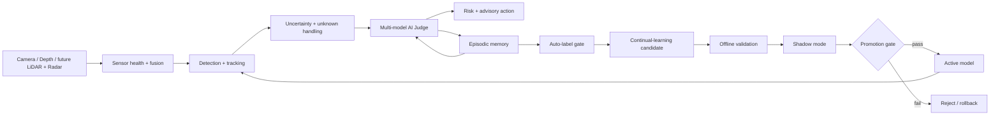

<div align="center">

# OpenADAS Vision Stack · CognitiveDrive AI

### Trustworthy Perception, Cognitive Memory & Continual Learning for Autonomous-Driving Research

[](https://github.com/hosseinAT/OpenADAS-Vision-Stack/actions/workflows/tests.yml)


[](LICENSE)

**Perception · Tracking · Uncertainty · Unknown Detection · AI Judge · Risk · Episodic Memory · Auto-Labeling · Continual Learning · Shadow Mode**

</div>

---

## Why this project exists

Modern autonomous-driving perception is not only an object-detection problem. A trustworthy system must also answer:

- **How certain am I?**
- **What if the object is outside my known classes?**
- **Which sensor/model should I trust under current conditions?**
- **Have I experienced a similar situation before?**
- **Can I learn from new observations without destroying old capabilities?**
- **How can a new model be validated before it is allowed to replace the active model?**

This repository develops these questions as one modular research platform.

The original OpenADAS baseline already implements classical lane analysis, tracking, approximate distance/TTC and risk visualization. **CognitiveDrive AI** extends that foundation toward uncertainty-aware perception, multi-evidence judging, episodic memory, gated auto-labeling and controlled model evolution.

> **Important:** this is a research/portfolio demonstrator. The decision outputs are advisory and are **not** a certified autonomous-driving control system for public-road actuation.

---

## Current engineering status

| Capability | Status | Evidence |
|---|---|---|
| Classical lane detection | ✅ Implemented | `openadas/lanes.py` |
| Lane geometry / lateral offset | ✅ Implemented | existing pipeline + tests |
| Object tracking baseline | ✅ Implemented | `openadas/tracking.py` |
| Approximate distance + TTC | ✅ Implemented | `openadas/distance.py` |
| Risk levels / visualization | ✅ Implemented | `openadas/risk.py`, `openadas/visualization.py` |
| CI / automated tests | ✅ Implemented | `.github/workflows/`, `tests/` |
| Transparent uncertainty baseline | ✅ Implemented | `openadas/cognitive/uncertainty.py` |
| Dynamic-trust multi-model judge | ✅ Implemented | `openadas/cognitive/judge.py` |
| Advisory cognitive decision layer | ✅ Implemented | `openadas/cognitive/decision.py` |
| Episodic similarity memory baseline | ✅ Implemented | `openadas/cognitive/memory.py` |
| Gated pseudo-label acceptance | ✅ Implemented | `openadas/cognitive/autolabel.py` |
| Candidate model promotion gate | ✅ Implemented | `openadas/cognitive/lifecycle.py` |
| Cognitive unit tests | ✅ Implemented | `tests/test_cognitive.py` |
| Synthetic end-to-end cognitive demo | ✅ Implemented | `examples/cognitive_demo.py` |
| RealSense RGB-D integration | 🟡 Next milestone | build guide |
| YOLO / custom wheelchair detector | 🟡 Planned integration | roadmap |
| ByteTrack / BoT-SORT | 🟡 Planned | roadmap |
| Persistent FAISS memory | 🟡 Planned | architecture |
| Continual-learning trainer | 🟡 Planned | architecture |
| CARLA scenario validation | 🟡 Planned | roadmap |
| ROS2 sensor graph | 🟡 Planned | roadmap |
| ONNX / TensorRT / Jetson Orin | 🟡 Planned | roadmap |
| LiDAR / radar fusion | 🔵 Later hardware phase | roadmap |

This table intentionally separates **implemented code** from **planned research work**.

---

## CognitiveDrive architecture



Full design: **[CognitiveDrive Architecture](docs/COGNITIVEDRIVE_ARCHITECTURE.md)**

Step-by-step implementation plan: **[Build From Zero to Demonstrator](docs/COGNITIVEDRIVE_BUILD_FROM_ZERO.md)**

---

## Core research idea

### 1. Observe

Use synchronized perception signals to create a tracked representation of the environment.

### 2. Estimate uncertainty

Do not treat detector confidence as truth. Track temporal class changes, confidence variation, sensor health and later ensemble disagreement.

### 3. Handle unknowns explicitly

Instead of forcing every object into a known class, allow safe hierarchical fallback labels:

```text
unknown_object
unknown_wheeled_object
unknown_mobility_device
vulnerable_road_user
```

### 4. Judge multiple evidence sources

Each source contributes a proposal and a **dynamic trust score**. A degraded camera should count less than a healthy complementary sensor/model.

### 5. Make an explainable safety recommendation

Prototype outputs:

```text
CONTINUE
SLOW_DOWN
PREPARE_TO_STOP
STOP_REQUEST
```

Every output includes a reason and risk score.

### 6. Store important experiences

Significant situations become episodes with an embedding, semantic/safety labels, uncertainty, action and outcome.

### 7. Retrieve similar past situations

The cognitive layer can find previous episodes that resemble the current observation and use them as additional evidence.

### 8. Auto-label conservatively

Pseudo-labels are accepted only after explicit gates such as track length, confidence, temporal consistency and multi-model agreement.

### 9. Train a candidate — never overwrite the active model

```text
model_v1_active
model_v2_candidate
```

### 10. Validate before promotion

The candidate must pass old-class regression, new-class improvement, calibration, latency and shadow-mode gates. Failed candidates are rejected; the previous active version remains available for rollback.

---

## Repository structure

```text
OpenADAS-Vision-Stack/
├── .github/workflows/          # CI
├── config/                     # runtime parameters
├── docs/
│   ├── COGNITIVEDRIVE_ARCHITECTURE.md
│   ├── COGNITIVEDRIVE_BUILD_FROM_ZERO.md
│   └── assets/
├── examples/
│   ├── cognitive_demo.py       # cognitive baseline demo
│   ├── demo_image.py
│   └── run_video.py
├── openadas/
│   ├── cognitive/
│   │   ├── types.py
│   │   ├── uncertainty.py
│   │   ├── judge.py
│   │   ├── decision.py
│   │   ├── memory.py
│   │   ├── autolabel.py
│   │   └── lifecycle.py
│   ├── distance.py
│   ├── lanes.py
│   ├── pipeline.py
│   ├── risk.py
│   ├── tracking.py
│   └── visualization.py
├── tests/
│   ├── test_cognitive.py
│   └── ...
├── Dockerfile
├── pyproject.toml
└── README.md
```

---

## Installation

### Linux / Ubuntu

```bash
git clone https://github.com/hosseinAT/OpenADAS-Vision-Stack.git
cd OpenADAS-Vision-Stack
python3 -m venv .venv
source .venv/bin/activate
python -m pip install --upgrade pip
pip install -e ".[dev]"
```

### Run tests

```bash
pytest -v
```

### Run the CognitiveDrive baseline demo

```bash
python -m examples.cognitive_demo
```

The demo uses synthetic evidence intentionally. It proves the software contracts and decision/memory lifecycle before real sensor dependencies are introduced.

---

## Example cognitive flow

A tracked object is inconsistently classified as `wheelchair` / `bicycle`. Depth indicates that it is close and approaching.

```text
Observation
  ↓
Uncertainty: MEDIUM/HIGH
  ↓
AI Judge: mobility_device
  ↓
Safety label: vulnerable_road_user
  ↓
Decision: PREPARE_TO_STOP
  ↓
Store episode
  ↓
Retrieve similar prior experience
  ↓
Auto-label gate
  ↓
Candidate model lifecycle
```

The objective is not to claim “human-level intelligence.” The objective is to build a **measurable engineering framework for experience-driven, uncertainty-aware autonomous perception**.

---

## Build order — what to do and what not to do

### Start with

1. existing PC baseline + tests
2. Intel RealSense RGB-D validation
3. detector integration
4. robust depth association
5. multi-object tracking
6. uncertainty / unknown handling
7. cognitive memory retrieval
8. gated auto-labeling
9. candidate training + regression evaluation
10. CARLA / shadow-mode evaluation
11. ONNX/TensorRT + Jetson
12. mobile demonstrator
13. LiDAR/radar/multi-camera fusion

### Do **not** start with

- buying all sensors at once
- direct control of a real road vehicle
- automatic self-training with no validation gate
- treating pseudo-labels as ground truth immediately
- claiming production readiness without measured validation
- committing large raw datasets or model binaries directly into normal Git history

See the complete engineering sequence in [the build guide](docs/COGNITIVEDRIVE_BUILD_FROM_ZERO.md).

---

## Evaluation plan

The mature project will publish measurements for:

### Perception

- precision / recall / F1
- mAP
- false negatives for vulnerable road users
- calibration error

### Tracking / geometry

- ID stability
- track fragmentation
- distance error against measured ground truth

### Cognitive layer

- unknown detection quality
- model agreement/disagreement
- memory retrieval top-k relevance
- auto-label acceptance precision

### Continual learning

- old-class recall delta
- new-class recall delta
- catastrophic forgetting
- candidate-vs-active disagreement

### Deployment

- latency
- FPS
- GPU/CPU memory
- temperature
- power

---

## Hardware roadmap

### Phase A — now

- PC / laptop
- Intel RealSense D456C

### Phase B — after software baseline passes

- NVIDIA Jetson Orin-class device
- NVMe SSD

### Phase C — mobile demonstrator

- research RC/mobile platform
- second camera

### Phase D — multi-sensor research

- LiDAR
- radar
- synchronized 360° camera setup

Hardware is added only when the software has an acceptance test that requires it.

---

## Safety and scope

This repository is intended for:

- recorded data
- simulation
- lab experiments
- small research demonstrators
- autonomous-driving perception research

It is **not** presented as ISO 26262-certified software, an ASIL safety mechanism, or a road-legal autonomous-driving controller.

---

## Roadmap

### Milestone 1 — Cognitive software baseline

- [x] uncertainty baseline
- [x] dynamic-trust judge
- [x] episodic memory baseline
- [x] safe decision manager
- [x] auto-label gate
- [x] candidate lifecycle gate
- [x] unit tests
- [x] synthetic end-to-end demo

### Milestone 2 — Real sensor perception

- [ ] RealSense RGB-D reader
- [ ] measured depth validation
- [ ] YOLO detector
- [ ] ByteTrack/BoT-SORT
- [ ] vulnerable-road-user classes

### Milestone 3 — Cognitive memory & learning

- [ ] learned embeddings
- [ ] persistent FAISS memory
- [ ] episode recorder
- [ ] pseudo-label dataset writer
- [ ] continual-learning trainer
- [ ] forgetting benchmark

### Milestone 4 — Validation & simulation

- [ ] CARLA scenario suite
- [ ] sensor degradation scenarios
- [ ] regression report generator
- [ ] shadow-mode comparison

### Milestone 5 — Edge & robotics

- [ ] ONNX export
- [ ] TensorRT FP16
- [ ] Jetson benchmark
- [ ] ROS2 nodes/topics
- [ ] mobile research demonstrator

### Milestone 6 — Advanced sensor fusion

- [ ] camera-LiDAR calibration
- [ ] radar association
- [ ] dynamic sensor trust
- [ ] multi-view consistency

---

## Portfolio summary

> **CognitiveDrive AI** is an autonomous-driving research project that extends a modular ADAS perception baseline with explicit uncertainty estimation, unknown-object handling, dynamically weighted multi-model evidence fusion, explainable risk decisions, episodic similarity memory, gated auto-labeling and a controlled candidate-model lifecycle. The architecture separates the online safety path from offline continual learning so that unvalidated self-training cannot directly replace an active perception model.

---

## Author

**Hossein Asadi**  
GitHub: [github.com/hosseinAT](https://github.com/hosseinAT)

---

## License

MIT — see [LICENSE](LICENSE).
