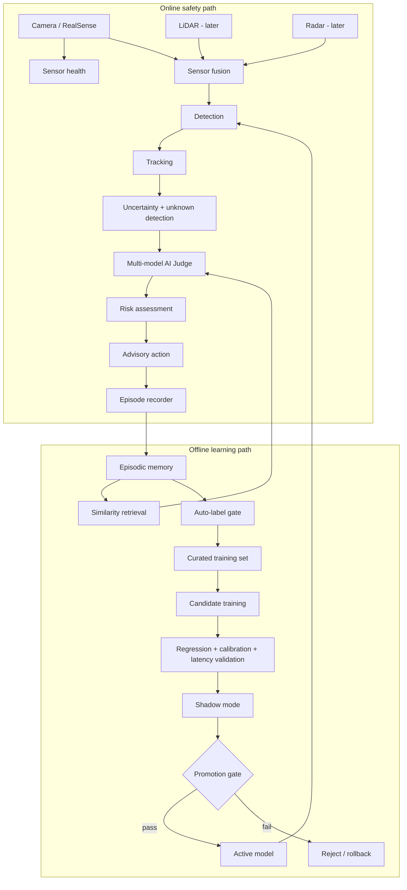
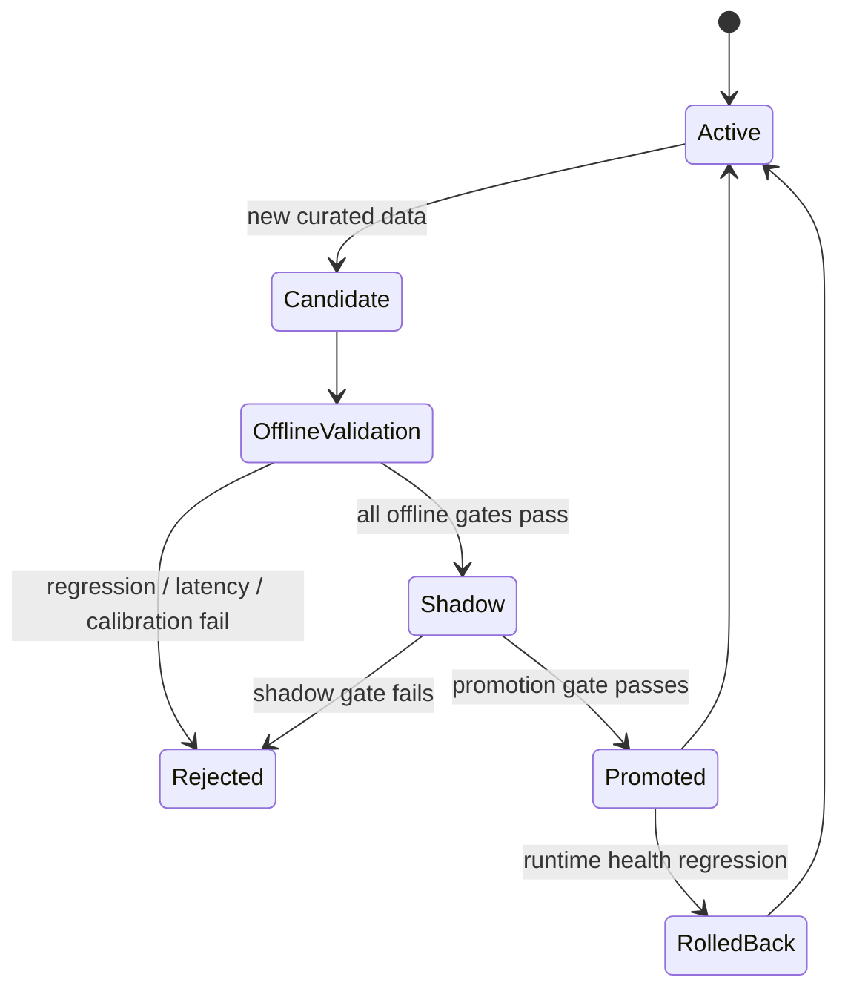

# CognitiveDrive AI — System Architecture

## Project positioning

CognitiveDrive AI extends the existing OpenADAS baseline toward a **trustworthy, self-improving autonomous-perception research platform**.

The design intentionally separates:

1. **online safety path** — fast perception, uncertainty, risk and advisory action
2. **offline learning path** — memory, auto-labeling, candidate training, validation and promotion

This prevents an unvalidated model from changing itself while making a safety-critical decision.

## High-level architecture



## Data contracts

### Observation

A tracked object should eventually expose:

```text
track_id
semantic_class
confidence
bbox / 3D extent
distance
relative motion
sensor health
class history
confidence history
embedding
```

### Evidence

Each AI/sensor source contributes:

```text
source
proposed label
confidence
dynamic trust score
metadata
```

The first implemented judge uses weighted support (`confidence x trust`). More advanced research versions can compare Bayesian fusion, calibrated ensembles, Dempster-Shafer or learned fusion.

## Unknown-object strategy

The system must never force an observation into a known class.

Recommended hierarchy:

```text
unknown_object
└── unknown_dynamic_object
    └── unknown_wheeled_object
        └── unknown_mobility_device
```

A semantic label may remain unknown while a safety label is already useful:

```text
semantic: unknown_mobility_device
safety: vulnerable_road_user
```

## Cognitive memory

Three logical layers are planned:

- **short-term track memory** — recent frames and motion history
- **episodic memory** — significant complete situations and outcomes
- **semantic memory** — consolidated concepts learned across episodes

The current code introduces the episodic similarity-retrieval baseline. Persistent vector indexing (for example FAISS) is a later phase.

## Safety concept

The current decision layer is **advisory** and intended for simulation, recorded data and small research demonstrators.

It must not be represented as production autonomous-driving control or as a certified functional-safety implementation.

Important separation:

```text
Perception / cognition research output
        ↓
CONTINUE / SLOW_DOWN / PREPARE_TO_STOP / STOP_REQUEST
        ↓
(no direct real-road actuation in this repository)
```

## Model lifecycle



Model promotion evidence should include:

- old-class recall change
- new-class recall change
- false-negative analysis
- calibration error
- latency/FPS
- memory usage
- critical scenario regressions
- shadow-mode disagreement statistics

## Repository implementation map

```text
openadas/cognitive/
├── types.py         # shared data contracts
├── uncertainty.py   # transparent uncertainty baseline
├── judge.py         # dynamic-trust evidence fusion
├── decision.py      # explainable advisory risk/action layer
├── memory.py        # episodic similarity retrieval baseline
├── autolabel.py     # pseudo-label acceptance gate
└── lifecycle.py     # candidate model promotion gate

tests/test_cognitive.py
examples/cognitive_demo.py
docs/COGNITIVEDRIVE_BUILD_FROM_ZERO.md
docs/COGNITIVEDRIVE_ARCHITECTURE.md
```

## Planned integrations

### Perception

- RealSense RGB-D
- YOLO / open-vocabulary detector
- ByteTrack / BoT-SORT
- custom wheelchair / wheelchair-user classes

### Sensor fusion

- multi-camera calibration
- LiDAR-camera projection
- radar association
- time synchronization

### Learning

- embeddings from vision backbone
- FAISS episodic retrieval
- pseudo-label dataset writer
- continual-learning trainer
- replay buffer
- evaluation report generator

### Deployment

- ONNX
- TensorRT FP16
- NVIDIA Jetson Orin
- ROS2 nodes/topics
- CARLA scenario runner

## What recruiters should be able to verify

Every mature feature should have at least one of:

- code
- unit/integration test
- benchmark
- screenshot/demo
- documented experiment
- metric table

The project should avoid unsupported claims such as “human-level learning” or “production-ready autonomous driving.” The engineering strength is demonstrated through transparent architecture, measurable experiments, explicit uncertainty and controlled model evolution.