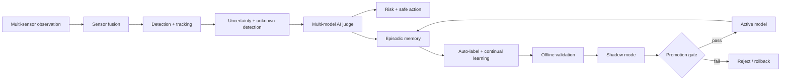

# CognitiveDrive AI — Build From Zero to Demonstrator

> **Purpose:** turn the existing OpenADAS prototype into a research-grade, reproducible demonstrator for trustworthy perception, cognitive memory, auto-labeling, continual learning, validation, and safe model promotion.

## 0. Engineering rule

Do **not** start with all hardware at once. Build one measurable layer at a time and only add complexity after the previous layer passes its acceptance tests.

### Final target



---

# Phase 1 — Development workstation

## Required now

- Ubuntu 22.04 LTS
- Python 3.10
- Git
- VS Code
- 16 GB RAM minimum; 32 GB recommended
- 100 GB free storage minimum
- Intel RealSense D456C (already available)
- USB 3.x cable
- NVIDIA GPU recommended but not required for the first milestone

## Do not buy yet

- LiDAR
- automotive radar
- multi-camera rig
- RC car
- additional Jetson
- expensive GNSS/IMU

These devices create calibration, synchronization, power, mechanical and driver problems before the core software is proven.

## Base installation

```bash
sudo apt update
sudo apt install -y git python3 python3-venv python3-pip build-essential cmake

git clone https://github.com/hosseinAT/OpenADAS-Vision-Stack.git
cd OpenADAS-Vision-Stack
python3 -m venv .venv
source .venv/bin/activate
python -m pip install --upgrade pip
pip install -e ".[dev]"
```

### Verify

```bash
python --version
pytest -v
```

Acceptance criterion: the existing baseline tests must pass before any CognitiveDrive feature work.

---

# Phase 2 — RealSense RGB + depth baseline

## Install

Install the Intel RealSense SDK and validate RGB/depth streams with `realsense-viewer` before writing project code.

Record:

- RGB frames
- depth frames
- timestamps
- camera intrinsics

## First physical test

Place a person/object at approximately 1 m, 2 m, 3 m and 5 m. Compare RealSense depth with a tape measure and save the error table.

Acceptance criterion:

- stable RGB stream
- stable depth stream
- no persistent USB frame drops
- measured distance error documented

Do not add YOLO until the sensor stream itself is trustworthy.

---

# Phase 3 — Deep-learning perception

Start with an off-the-shelf detector to prove the pipeline.

Recommended initial classes:

- person
- bicycle
- car
- motorcycle

Then add project-specific classes such as:

- wheelchair
- wheelchair user
- mobility scooter
- stroller

Required output per detection:

```json
{
  "frame_id": 152,
  "timestamp_s": 12.63,
  "class_name": "person",
  "confidence": 0.92,
  "bbox_xyxy": [320, 140, 510, 590]
}
```

Acceptance criterion:

- repeatable inference on recorded video
- confidence and boxes are logged
- runtime/FPS measured

Do not claim a custom trained model until a separate training dataset, validation split and evaluation report exist.

---

# Phase 4 — Depth association

For each detection, estimate robust object depth using a central region of the bounding box.

Do not use a single center pixel. Instead:

1. crop a central ROI
2. remove zero/invalid depth
3. reject outliers
4. use median depth
5. smooth temporally

Output:

```text
track=7 class=person confidence=0.92 distance=4.8m
```

Acceptance criterion: error is measured at known distances and reported, not guessed.

---

# Phase 5 — Multi-object tracking

Use ByteTrack or BoT-SORT when detector integration is mature. Keep a history per track:

- class predictions
- confidence
- depth
- velocity proxy
- missed frames
- bounding-box stability

This history becomes the input to uncertainty estimation and memory.

---

# Phase 6 — Uncertainty and unknown-object handling

A high detector confidence is **not** equivalent to trustworthy perception.

Compute at least:

- confidence level
- confidence variance over time
- class-switch rate
- track fragmentation
- geometric consistency
- sensor health

Prototype states:

- `LOW`
- `MEDIUM`
- `HIGH`

Unknown objects must be represented explicitly. Never force every observation into a known class.

Safe fallback labels can be hierarchical, for example:

```text
unknown_object
unknown_wheeled_object
unknown_mobility_device
vulnerable_road_user
```

---

# Phase 7 — Risk and decision layer

The first version is advisory only; it must **not** control a real road vehicle.

Example outputs:

- `CONTINUE`
- `SLOW_DOWN`
- `PREPARE_TO_STOP`
- `STOP_REQUEST`

Inputs:

- distance
- approach trend
- uncertainty
- vulnerable-road-user class
- sensor degradation

Every decision must include a machine-readable reason.

---

# Phase 8 — Episodic memory

Store significant situations, not every frame forever.

Trigger examples:

- unknown object
- high uncertainty
- class disagreement
- near collision
- critical risk
- model disagreement
- novel environment

Each episode should contain:

- short pre-event window
- event
- short post-event window
- sensor observations
- perception outputs
- selected action
- result
- embedding for similarity search

Memory is used to retrieve similar past situations and provide evidence to the reasoning layer.

---

# Phase 9 — Multi-model AI judge

The judge combines multiple evidence sources rather than simple majority voting.

Potential evidence:

- detector A
- detector B / open-vocabulary detector
- vision-language model
- LiDAR geometry
- radar motion
- track history
- memory similarity
- sensor health

Each evidence source receives a dynamic trust weight. A degraded camera must contribute less than a healthy LiDAR/radar channel.

The judge produces:

```json
{
  "semantic_label": "mobility_device",
  "safety_label": "vulnerable_road_user",
  "confidence": 0.93,
  "agreement": 0.89,
  "evidence_count": 5
}
```

---

# Phase 10 — Auto-labeling

Auto-labeling is gated. It is not `prediction -> immediate ground truth`.

A pseudo-label may be accepted only after checks such as:

- minimum track duration
- temporal class consistency
- minimum confidence
- multi-view consistency
- multi-model agreement
- geometric plausibility

Low-confidence cases remain in a temporary unknown hierarchy.

---

# Phase 11 — Continual learning

Train a **candidate** model, never overwrite the active model directly.

```text
model_v1_active
model_v2_candidate
```

Use:

- replay memory
- hard-example mining
- knowledge distillation where useful
- held-out validation set

Measure catastrophic forgetting explicitly on old classes.

---

# Phase 12 — Validation and model promotion

A candidate must pass:

- old-class regression tests
- new-class metrics
- calibration checks
- latency/FPS limit
- memory/resource limits
- scenario tests
- failure-case replay

Then run it in **shadow mode** beside the active model.

The candidate does not control anything; disagreement is logged.

Only after passing a promotion gate may it become active. Keep the previous active model for rollback.

---

# Phase 13 — CARLA / simulation

Use simulation before mobile hardware for:

- difficult weather
- night scenes
- occlusion
- rare vulnerable-road-user cases
- collision-risk scenarios
- controlled sensor degradation

Simulation is for repeatability and regression; it does not replace real-world validation.

---

# Phase 14 — Edge deployment

After the PC pipeline is stable:

1. export model to ONNX
2. validate ONNX numerically
3. convert/benchmark TensorRT FP16
4. measure latency, FPS, memory, temperature and power
5. deploy to Jetson Orin-class hardware

Only after this phase should an RC platform be considered.

---

# Phase 15 — Mobile demonstrator

Recommended order:

```text
RealSense -> second camera -> LiDAR -> radar -> 360° multi-camera
```

The RC/mobile platform demonstrates integration, not road-legal autonomy.

---

# Definition of Done for the portfolio demonstrator

A recruiter should be able to see evidence for all of the following:

- reproducible installation
- tests passing in CI
- real sensor input
- detection and tracking
- metric-based distance evaluation
- uncertainty
- unknown handling
- explainable risk decision
- episodic memory
- similarity retrieval
- auto-label gate
- candidate model lifecycle
- regression evaluation
- shadow-mode design
- clear limitations
- benchmark tables
- demo video/images

The project is strongest when every claim links to code, a test, a metric, or a recorded experiment.